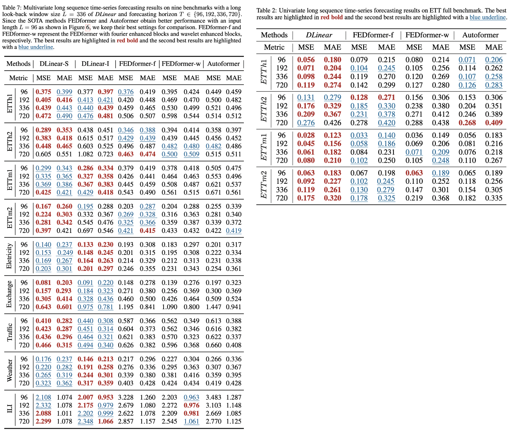
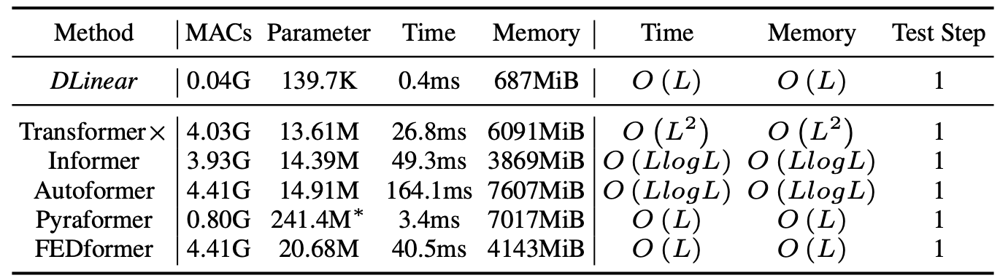
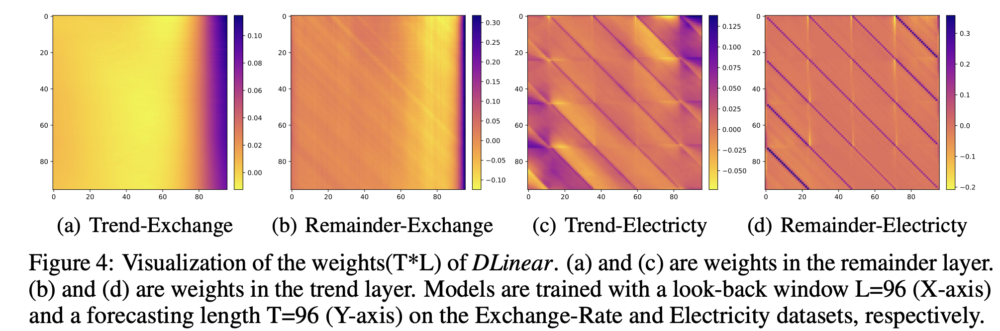

# DLinear

This is a Pytorch implementation of DLinear: "[Are Transformers Effective for Time Series Forecasting?](https://arxiv.org/pdf/2205.13504.pdf)". 


## Features
- [x] Support both [Univariate](https://github.com/cure-lab/DLinear/tree/main/scripts/EXP-LongForecasting/DLinear/univariate) and [Multivariate](https://github.com/cure-lab/DLinear/tree/main/scripts/EXP-LongForecasting/DLinear) long-term time series forecasting.
- [x] Support visualization of weights.
- [x] Support scripts on different [look-back window size](https://github.com/cure-lab/DLinear/tree/main/scripts/EXP-LookBackWindow).


Beside DLinear, we provide five significant forecasting Transformers to re-implement the results in the paper.
- [x] [Transformer](https://arxiv.org/abs/1706.03762) (NeuIPS 2017)
- [x] [Informer](https://arxiv.org/abs/2012.07436) (AAAI 2021 Best paper)
- [x] [Autoformer](https://arxiv.org/abs/2106.13008) (NeuIPS 2021)
- [x] [Pyraformer](https://openreview.net/pdf?id=0EXmFzUn5I) (ICLR 2022 Oral)
- [x] [FEDformer](https://arxiv.org/abs/2201.12740) (ICML 2022)


## Detailed Description
We provide all experiment script files in `./scripts`:
| Files      |                              Interpretation                          |
| ------------- | -------------------------------------------------------| 
| EXP-LongForecasting      | Long-term Time Series Forecasting Task                    |
| EXP-LookBackWindow      | Study the impact of different look-back window size   | 
| EXP-Embedding        | Study the impact of different embedding strategies      |


This code is simply build on the code base of Autoformer. We appreciate the following github repos a lot for their valuable code base or datasets:

The implementation of Autoformer, Informer, Transformer is from https://github.com/thuml/Autoformer

The implementation of FEDformer is from https://github.com/MAZiqing/FEDformer

The implementation of Pyraformer is from https://github.com/alipay/Pyraformer

## DLinear
### Structure of DLinear

Although DLinear is simple, it has some compelling characteristics:
- An O(1) maximum signal traversing path length: The shorter the path, the better the dependencies are captured, making DLinear capable of capturing both short-range and long-range temporal relations.
- High-efficiency: As each branch has only one linear layer, it costs much lower memory and fewer parameters and has a faster inference speed than existing Transformers.
- Interpretability: After training, we can visualize weights from the seasonality and trend branches to have some insights on the predicted values.
- Easy-to-use: DLinear can be obtained easily without tuning model hyper-parameters.

### Comparison with Transformers

In Multivariate long sequence time-series forecasting(left table), DLinear outperforms FEDformer by over 40% on Exchange rate, around 30% on Traffic, Electricity, and Weather, and around 25% on ETTm1.

In Univariate long sequqence time-series forecasting(right table), DLinear outperforms transformer-based methods in most cases.
### Efficiency

Comparison of method efficiency on the Electricity dataset with a look-back window size of 96 and forecasting horizon of 720 steps. MACs are the number of multiply-accumulate operations. The inference time is an average result of 5 runs.
## Getting Started
### Environment Requirements

First, please make sure you have installed Conda. Then, our environment can be installed by:
```
conda create -n DLinear python=3.6.9
conda activate DLinear
pip install -r requirements.txt
```


### Data Preparation

You can obtain all the nine benchmarks from [Google Drive](https://drive.google.com/drive/folders/1ZOYpTUa82_jCcxIdTmyr0LXQfvaM9vIy) provided in Autoformer. All the datasets are well pre-processed and can be used easily.

```
mkdir dataset
```
**Please put them in the `./dataset` directory**

### Training Example
- In `scripts/ `, we provide the model implementation *Dlinear/Autoformer/Informer/Transformer*
- In `FEDformer/scripts/`, we provide the *FEDformer* implementation
- In `Pyraformer/scripts/`, we provide the *Pyraformer* implementation

For example:

To train the **DLinear** on **Exchange-Rate dataset**, you can use the scipt `scripts/EXP-LongForecasting/DLinear/exchange_rate.sh`:
```
sh scripts/EXP-LongForecasting/DLinear/exchange_rate.sh
```
It will start to train DLinear, the results will be shown in `logs/LongForecasting`. 

All scripts about using DLinear on long forecasting task is in `scripts/EXP-LongForecasting/DLinear/`, you can run them in a similar way. The default look-back window in scripts is 96, DLinear generally achieves better results with longer look-back window as dicussed in the paper. For instance, you can simpy change the **seq_len** (look-back window size) in scripts to 336 to obtain better performance.

Scripts about look-back window size and long forecasting of FEDformer and Pyraformer is in `FEDformer/scripts` and `Pyraformer/scripts`, respectively. To run them, you need to first `cd FEDformer` or `cd Pyraformer`. Then, you can use sh to run them in a similar way. Logs will store in `logs/`.

Each experiment in `scripts/EXP-LongForecasting/DLinear/` takes 5min-20min. For other Transformer scripts, since we put all related experiments in one script file, directly running them will take 8 hours-1 day. You can keep the experiments you interested in and comment out the others. 

### DLinear Weights Visualization
As shown in our paper, the weights of DLinear can reveal some charateristic of the data, i.e., the periodicity. We provide the weight visualization of DLinear in `weight_plot.py`. To run the visualization, you need to input the model path (model_name) of DLinear (the model directory in `./checkpoint` by default).


## Citing

If you find this repository useful for your work, please consider citing it as follows:

```bibtex
@article{Zeng2022AreTE,
  title={Are Transformers Effective for Time Series Forecasting?},
  author={Ailing Zeng and Muxi Chen and Lei Zhang and Qiang Xu},
  journal={arXiv preprint arXiv:2205.13504},
  year={2022}
}
```

Please remember to cite all the datasets and compared methods if you use them in your experiments.
