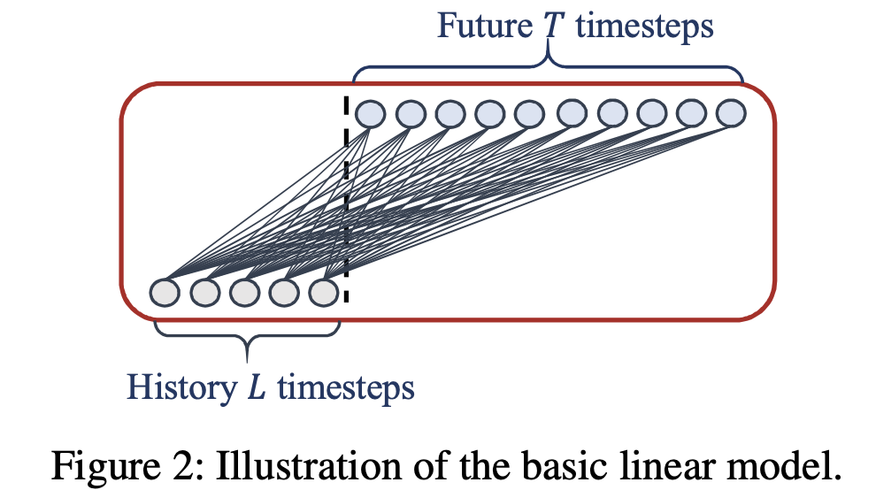
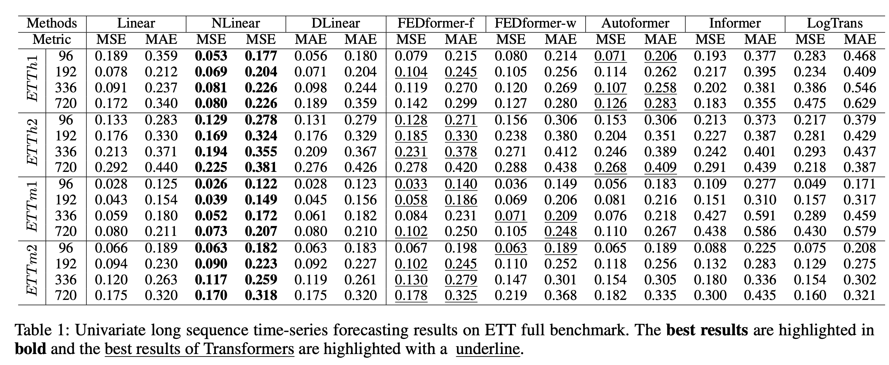
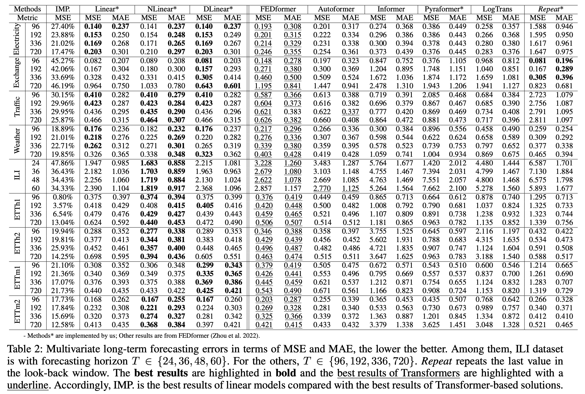

# Are Transformers Effective for Time Series Forecasting? (AAAI 2023)

This repo is the official Pytorch implementation of LTSF-Linear: "[Are Transformers Effective for Time Series Forecasting?](https://arxiv.org/pdf/2205.13504.pdf)". 


## Updates
- [2024/01/28] Our model has been included in [NeuralForecast](https://github.com/Nixtla/neuralforecast). Special thanks to the contributor [@cchallu](https://github.com/cchallu)!
- [2022/11/23] Accepted to AAAI 2023 with three strong accept! We also release a **[benchmark for long-term time series forecasting](LTSF-Benchmark.md)** for further research.
- [2022/08/25] We update our [paper](https://arxiv.org/pdf/2205.13504.pdf) with comprehensive analyses on why existing LTSF-Transformers do not work well on the LTSF problem!
- [2022/08/25] Besides DLinear, we're excited to add two Linear models to the paper and this repo. Now we have an LTSF-Linear family!
  - Linear: Just one linear layer.
  - DLinear: Decomposition Linear to handle data with trend and seasonality patterns.
  - NLinear: A Normalized Linear to deal with train-test set distribution shifts. See section 'LTSF-Linear' for more details. 

- [2022/08/25] We update some scripts of LTSF-Linear. 
  - Linear, NLinear, and DLinear use the same scripts.
  - Some results of DLinear are slightly different now.


## Features
- [x] Add a [benchmark](LTSF-Benchmark.md) for long-term time series forecasting.
- [x] Support both [Univariate](https://github.com/cure-lab/DLinear/tree/main/scripts/EXP-LongForecasting/DLinear/univariate) and [Multivariate](https://github.com/cure-lab/DLinear/tree/main/scripts/EXP-LongForecasting/DLinear) long-term time series forecasting.
- [x] Support visualization of weights.
- [x] Support scripts on different [look-back window size](https://github.com/cure-lab/DLinear/tree/main/scripts/EXP-LookBackWindow).

Besides LTSF-Linear, we provide five significant forecasting Transformers to re-implement the results in the paper.
- [x] [Transformer](https://arxiv.org/abs/1706.03762) (NeuIPS 2017)
- [x] [Informer](https://arxiv.org/abs/2012.07436) (AAAI 2021 Best paper)
- [x] [Autoformer](https://arxiv.org/abs/2106.13008) (NeuIPS 2021)
- [x] [Pyraformer](https://openreview.net/pdf?id=0EXmFzUn5I) (ICLR 2022 Oral)
- [x] [FEDformer](https://arxiv.org/abs/2201.12740) (ICML 2022)


## Detailed Description
We provide all experiment script files in `./scripts`:
| Files      |                              Interpretation                          |
| ------------- | -------------------------------------------------------| 
| EXP-LongForecasting      | Long-term Time Series Forecasting Task                    |
| EXP-LookBackWindow      | Study the impact of different look-back window sizes   | 
| EXP-Embedding        | Study the effects of different embedding strategies      |


This code is simply built on the code base of Autoformer. We appreciate the following GitHub repos a lot for their valuable code base or datasets:

The implementation of Autoformer, Informer, and Transformer is from https://github.com/thuml/Autoformer

The implementation of FEDformer is from https://github.com/MAZiqing/FEDformer

The implementation of Pyraformer is from https://github.com/alipay/Pyraformer

## LTSF-Linear
### LTSF-Linear family

LTSF-Linear is a set of linear models. 
- Linear: It is just a one-layer linear model, but it outperforms Transformers.
- NLinear: **To boost the performance of Linear when there is a distribution shift in the dataset**, NLinear first subtracts the input by the last value of the sequence. Then, the input goes through a linear layer, and the subtracted part is added back before making the final prediction. The subtraction and addition in NLinear are a simple normalization for the input sequence.
- DLinear: It is a combination of a Decomposition scheme used in Autoformer and FEDformer with linear layers. It first decomposes a raw data input into a trend component by a moving average kernel and a remainder (seasonal) component. Then, two one-layer linear layers are applied to each component and we sum up the two features to get the final prediction. By explicitly handling trend, **DLinear enhances the performance of a vanilla linear when there is a clear trend in the data.** 

Although LTSF-Linear is simple, it has some compelling characteristics:
- An O(1) maximum signal traversing path length: The shorter the path, the better the dependencies are captured, making LTSF-Linear capable of capturing both short-range and long-range temporal relations.
- High-efficiency: As each branch has only one linear layer, it costs much lower memory and fewer parameters and has a faster inference speed than existing Transformers.
- Interpretability: After training, we can visualize weights to have some insights into the predicted values.
- Easy-to-use: LTSF-Linear can be obtained easily without tuning model hyper-parameters.

### Comparison with Transformers
Univariate Forecasting:

Multivariate Forecasting:

LTSF-Linear outperforms all transformer-based methods by a large margin.

### Efficiency

Comparison of method efficiency with Look-back window size 96 and Forecasting steps 720 on Electricity. MACs are the number of multiply-accumulate operations. We use DLinear for comparison since it has the double cost in LTSF-Linear. The inference time averages 5 runs.

## Getting Started
### Environment Requirements

First, please make sure you have installed Conda. Then, our environment can be installed by:
```
conda create -n LTSF_Linear python=3.6.9
conda activate LTSF_Linear
pip install -r requirements.txt
```

### Data Preparation

You can obtain all the nine benchmarks from [Google Drive](https://drive.google.com/drive/folders/1ZOYpTUa82_jCcxIdTmyr0LXQfvaM9vIy) provided in Autoformer. All the datasets are well pre-processed and can be used easily.

```
mkdir dataset
```
**Please put them in the `./dataset` directory**

### Training Example
- In `scripts/ `, we provide the model implementation *Dlinear/Autoformer/Informer/Transformer*
- In `FEDformer/scripts/`, we provide the *FEDformer* implementation
- In `Pyraformer/scripts/`, we provide the *Pyraformer* implementation

For example:

To train the **LTSF-Linear** on **Exchange-Rate dataset**, you can use the script `scripts/EXP-LongForecasting/Linear/exchange_rate.sh`:
```
sh scripts/EXP-LongForecasting/Linear/exchange_rate.sh
```
It will start to train DLinear by default, the results will be shown in `logs/LongForecasting`. You can specify the name of the model in the script. (Linear, DLinear, NLinear)

All scripts about using LTSF-Linear on long forecasting task is in `scripts/EXP-LongForecasting/Linear/`, you can run them in a similar way. The default look-back window in scripts is 336, LTSF-Linear generally achieves better results with longer look-back window as dicussed in the paper. 

Scripts about look-back window size and long forecasting of FEDformer and Pyraformer are in `FEDformer/scripts` and `Pyraformer/scripts`, respectively. To run them, you need to first `cd FEDformer` or `cd Pyraformer`. Then, you can use sh to run them in a similar way. Logs will be stored in `logs/`.

Each experiment in `scripts/EXP-LongForecasting/Linear/` takes 5min-20min. For other Transformer scripts, since we put all related experiments in one script file, directly running them will take 8 hours per day. You can keep the experiments you are interested in and comment on the others. 

### Weights Visualization
As shown in our paper, the weights of LTSF-Linear can reveal some characteristics of the data, i.e., the periodicity. As an example, we provide the weight visualization of DLinear in `weight_plot.py`. To run the visualization, you need to input the model path (model_name) of DLinear (the model directory in `./checkpoint` by default). To obtain smooth and clear patterns, you can use the initialization we provided in the file of linear models.  


## Citing

If you find this repository useful for your work, please consider citing it as follows:

```BibTeX
@inproceedings{Zeng2022AreTE,
  title={Are Transformers Effective for Time Series Forecasting?},
  author={Ailing Zeng and Muxi Chen and Lei Zhang and Qiang Xu},
  journal={Proceedings of the AAAI Conference on Artificial Intelligence},
  year={2023}
}
```

Please remember to cite all the datasets and compared methods if you use them in your experiments.
